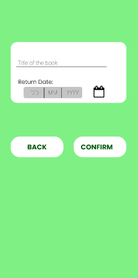
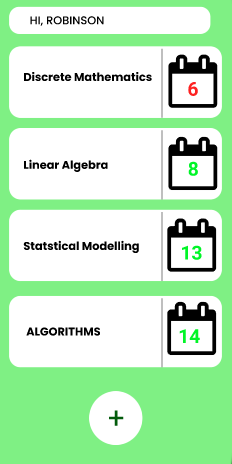

# Booktracker App 📒📈

A simple booktracker app as an introduction to flutter-app development, and contribution to opensource projects.

Hacktoberfest is a month-long celebration of open source software run by DigitalOcean. During the month of October, you are invited to join open-source software enthusiasts, beginners, and the developer community by contributing to open-source projects.

Git Set Code is an event by Google Developer Student Club JSSSTU, Mysuru, which aims to ease the open source journey of a developer.
This session provides a hands-on experience of Git encouraging people to participate in open source contribution and community events.

## Base project structure

The base project is a bare-bones library book tracker app where you can only add and view books that you have borrowed.

**Tech stack used:** Flutter, sqlite (backend)

- Flutter
- SQLite

## Project setup instructions

- To get all dependencies use:

  `flutter pub get`

- To run the project use:

  `flutter run`

## What is the final version of the project?

Click [here](https://www.figma.com/file/XyMvKlsBUw1lPUn4ZVcxdd/BOOK-TRACKER?node-id=0%3A1) for the UI design and prototype of the project.

**Intended Final Project:** A functional library book tracker in which you can add, remove, edit and view books, and get a reminder after 2 weeks to return them. This is not a library management system, but it is a personal reminder app.

## What should I work on?

The issues tab on our GitHub repo serves as a list of features that are necessary or in-demand and a list of bugs that need to be fixed. Feel free to pick up an issue and work on it, but before you do so, please comment on the respective issue which you want to work on with the details on how you want to approach the issue, so that we can assign you the issue. You can also add more issues on the list as a form of feature request, or to present a bug in our app.

## Okay, so how do I contribute/start?

### Prerequisites:

- A GitHub account
- git CLI

### Setting up git:

- [Download and install the latest version of git CLI](https://git-scm.com/downloads)
- [GitHub's "Getting started with git" Docs](https://docs.github.com/en/get-started/getting-started-with-git)

Please refer to each project's style and contribution guidelines for submitting patches and additions. In general, we follow the "fork-and-pull" Git workflow.

- Fork the repo on GitHub

  > [Link to Docs](https://docs.github.com/en/get-started/quickstart/fork-a-repo#step-2-create-a-local-clone-of-your-fork)

  By forking a repository you create your own copy of the project onto your GitHub account and make your changes there.

- Clone the project to your own machine

  > [Link to Docs](https://docs.github.com/en/get-started/quickstart/fork-a-repo#cloning-your-forked-repository)

  Cloning a project means that you are setting up the project on your local system.

  Please follow the given naming convention for naming the branch after forking: `<issue-type>/<issue-name-in-short>`

  For example, for the issue https://github.com/gdsc-jssstu/booktracker-app/issues/6, the branch name would be `enhancement/dark-theme-toggle`

- Keeping your own forked repo in sync with the main repo

  > [Link to Docs](https://docs.github.com/en/github/collaborating-with-pull-requests/working-with-forks/syncing-a-fork)

  Sync a fork of a repository to keep it up-to-date with the upstream repository.

- Commit changes to your own branch

  > [Link to Docs](https://www.atlassian.com/git/tutorials/saving-changes/git-commit)

  Committing means making changes to the project and adding your changes to GitHub.

- Push your work back up to your fork

  > [Link to Docs](https://www.atlassian.com/git/tutorials/syncing/git-push)

  Pushing is how you transfer commits from your local repository to a remote repo.

- Submit a Pull request so that we can review your changes

  > [Link to Docs](https://docs.github.com/en/github/collaborating-with-pull-requests/proposing-changes-to-your-work-with-pull-requests/about-pull-requests)

  Pull request means submitting your changes to the original project for the review. Once the maintainers of the project feel that your changes are appropriate then your pull request will be merged.

Be sure to merge the latest from "upstream" before making a pull request and resolve all merge conflicts! Read more about resolving merge conflicts [here](https://docs.github.com/en/github/collaborating-with-pull-requests/addressing-merge-conflicts).

---
